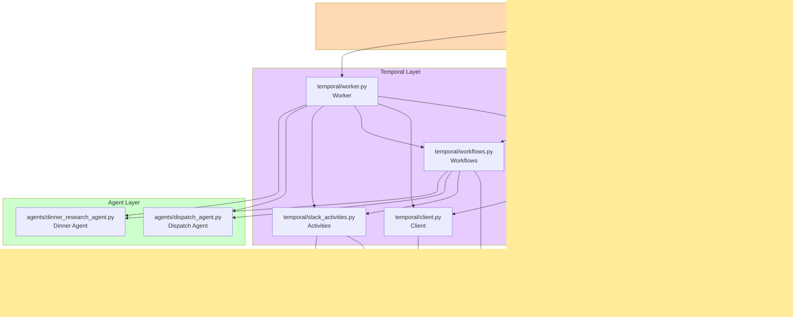

# Architecture Diagrams

## Overview

This project is a Slack bot built with FastAPI, Temporal, and PydanticAI that helps users decide what to order for dinner. The architecture follows a layered approach with clear separation of concerns:

- **External Interfaces**: Slack Events API for receiving messages
- **API Layer**: FastAPI endpoints for handling Slack webhook events
- **Orchestration Layer**: Temporal workflows for durable execution
- **Activity Layer**: Temporal activities for Slack API interactions
- **Agent Layer**: PydanticAI agents for intelligent conversation and research

The system uses Temporal to manage long-running workflows that handle entire Slack conversation threads, with PydanticAI agents providing intelligent responses and restaurant research capabilities.

## System Architecture

### Description

The system architecture shows the layered structure of the application. When a user mentions the bot in Slack or replies to a thread:

1. Slack sends a webhook to the FastAPI endpoint (`/slack-events`)
2. The API layer validates the request and starts/signals a Temporal workflow
3. The workflow orchestrates the conversation, executing activities and agents
4. Slack activities interact with the Slack API to read messages and post responses
5. PydanticAI agents (dispatch and dinner research) provide intelligent processing
6. External services (OpenAI via PydanticAI, DuckDuckGo for search) are called as needed

## Component Relationships

### Description

This diagram shows how the main Python modules connect and interact with each other. The arrows indicate import dependencies and data flow:

- `app.py` is the entry point that bootstraps the FastAPI application and Temporal worker
- `api.py` contains the route handlers that receive Slack events
- `dependencies.py` provides dependency injection for FastAPI
- `temporal/workflows.py` orchestrates the conversation flow
- `temporal/slack_activities.py` handles all Slack API interactions
- The agent modules define the AI agents with their instructions and tools

## Class Hierarchies

### Description

This diagram shows the class structure and relationships. The project uses Pydantic BaseModel extensively for data validation and dataclasses for agent output types. Key class categories:

- **Event Models**: Represent Slack events (AppMentionEvent, MessageChannelsEvent)
- **Message Models**: Represent Slack messages and interactions (SlackReply, SlackReaction, SlackMessageID)
- **Agent Output Types**: Define structured outputs from AI agents (NoResponse, SlackResponse, DinnerSuggestions)
- **Configuration**: Settings class for environment variables
- **Workflows**: SlackThreadWorkflow class that orchestrates conversation handling

## Module Dependencies

### Description

This diagram shows the import dependencies between Python modules in the project. Arrows point from modules that import to modules being imported. The structure follows a clean dependency hierarchy:

- Core configuration modules (settings, models) have no internal dependencies
- Infrastructure modules (dependencies, slack) depend on configuration
- API layer depends on models, settings, and Temporal
- Temporal layer depends on configuration and agents
- Application entry point depends on all layers

## Data Flow

### Description

This sequence diagram shows how data flows through the system when a user mentions the bot in Slack. The flow demonstrates:

1. Slack webhook event delivery
2. Event validation and workflow creation
3. Workflow orchestration of activities and agents
4. Message retrieval from Slack
5. AI agent processing (dispatch then dinner research)
6. Response posting back to Slack

The workflow maintains state across the entire conversation thread and coordinates all asynchronous operations.

## External Service Integration

### Description

This diagram shows how the system integrates with external services and APIs:

- **Slack API**: For receiving events and posting messages
- **Temporal Server**: For workflow orchestration (local or cloud)
- **OpenAI API**: For LLM capabilities via PydanticAI
- **DuckDuckGo**: For web search via PydanticAI tools
- **Logfire**: For observability and monitoring

## Key Architectural Patterns

### 1. Event-Driven Architecture
- Slack events trigger workflow creation/signaling
- Workflows queue events and process them asynchronously
- Activities interact with external services

### 2. Durable Execution
- Temporal ensures workflows survive crashes and restarts
- Conversation state is maintained across long-running threads
- Activities are retryable and fault-tolerant

### 3. Agent-Based AI
- PydanticAI agents provide structured outputs with type safety
- Dispatch agent determines intent and routes to specialized agents
- Dinner research agent performs specialized research tasks

### 4. Dependency Injection
- FastAPI dependencies provide Temporal client and Slack configuration
- Settings are centralized and cached
- Lifespan context manages application lifecycle

### 5. Type Safety
- Pydantic models validate all data at runtime
- Type hints throughout codebase
- Pyright strict mode enabled

## Technology Stack

| Layer | Technologies |
|-------|-------------|
| Web Framework | FastAPI 0.115.0+ |
| AI Framework | PydanticAI 1.0.2+ |
| Workflow Engine | Temporal (via temporalio) |
| Data Validation | Pydantic |
| External APIs | Slack SDK 3.36.0+ |
| LLM Provider | OpenAI (gpt-5-mini) |
| Search | DuckDuckGo |
| Observability | Logfire 4.3.4+ |
| Language | Python 3.12+ |

## File Reference

### Core Application Files
- `pydantic_temporal_example/app.py` - Application entry point
- `pydantic_temporal_example/api.py` - FastAPI routes (lines 23-78)
- `pydantic_temporal_example/models.py` - Pydantic data models (lines 1-92)
- `pydantic_temporal_example/settings.py` - Configuration (lines 6-12)

### Temporal Components
- `pydantic_temporal_example/temporal/workflows.py` - SlackThreadWorkflow (lines 35-108)
- `pydantic_temporal_example/temporal/slack_activities.py` - Slack API activities (lines 12-82)
- `pydantic_temporal_example/temporal/worker.py` - Worker setup (lines 17-36)
- `pydantic_temporal_example/temporal/client.py` - Client builder (lines 8-21)

### AI Agents
- `pydantic_temporal_example/agents/dispatch_agent.py` - Intent classification (lines 64-94)
- `pydantic_temporal_example/agents/dinner_research_agent.py` - Restaurant research (lines 35-43)

### Infrastructure
- `pydantic_temporal_example/dependencies.py` - FastAPI dependencies (lines 14-28)
- `pydantic_temporal_example/slack.py` - Request validation (lines 13-48)
