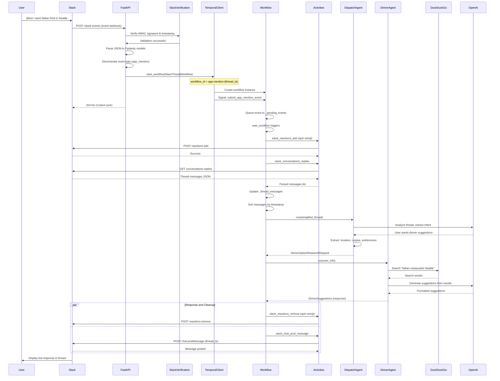
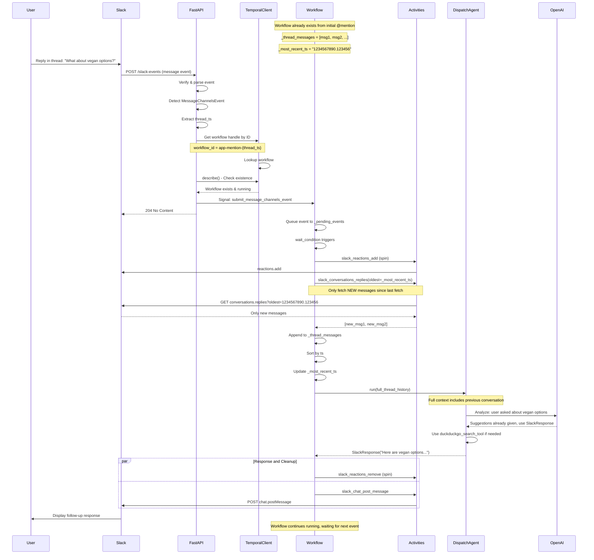
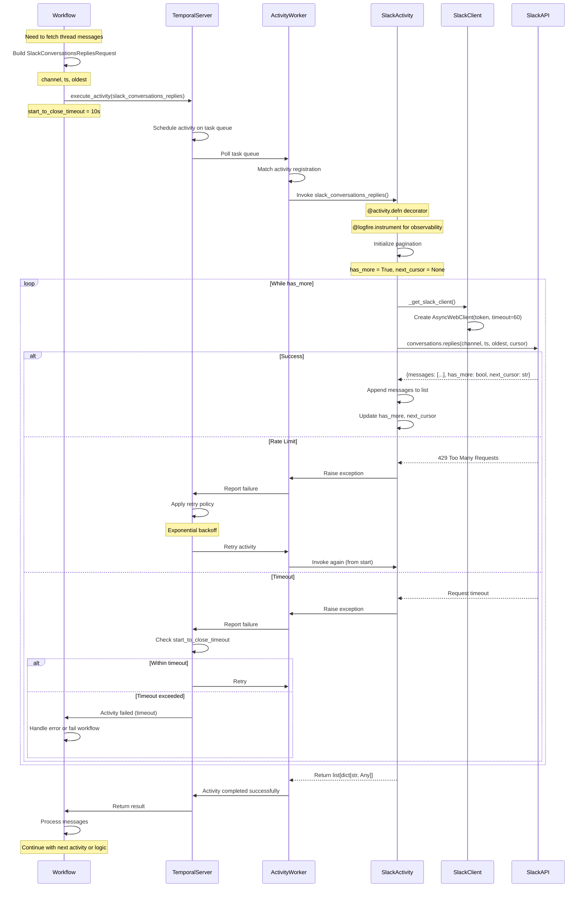
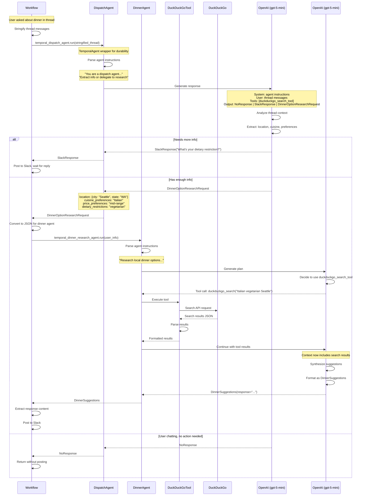

```mermaid
sequenceDiagram
    participant Slack
    participant FastAPI
    participant SlackMiddleware
    participant PydanticAdapter
    participant EventRouter
    participant WorkflowHandler

    Slack->>FastAPI: POST /slack-events
    Note over Slack,FastAPI: Headers:<br/>x-slack-signature: v0=abc123...<br/>x-slack-request-timestamp: 1234567890<br/><br/>Body: {"type": "event_callback", "event": {...}}

    FastAPI->>FastAPI: Invoke dependency: get_verified_slack_events_body
    FastAPI->>SlackMiddleware: Dependency injection

    SlackMiddleware->>SlackMiddleware: Extract x-slack-request-timestamp
    alt Missing timestamp
        SlackMiddleware-->>FastAPI: HTTPException(401, "Missing timestamp")
        FastAPI-->>Slack: 401 Unauthorized
    end

    SlackMiddleware->>SlackMiddleware: Check timestamp freshness
    Note over SlackMiddleware: current_time - timestamp < 5 minutes
    alt Timestamp too old
        SlackMiddleware-->>FastAPI: HTTPException(401, "Timestamp too old")
        FastAPI-->>Slack: 401 Unauthorized
    end

    SlackMiddleware->>SlackMiddleware: Extract x-slack-signature
    alt Missing signature
        SlackMiddleware-->>FastAPI: HTTPException(401, "Missing signature")
        FastAPI-->>Slack: 401 Unauthorized
    end

    SlackMiddleware->>SlackMiddleware: Read request body
    SlackMiddleware->>SlackMiddleware: Build signature base string
    Note over SlackMiddleware: base = f"v0:{timestamp}:{body}"
    SlackMiddleware->>SlackMiddleware: Compute HMAC-SHA256
    Note over SlackMiddleware: expected = "v0=" + hmac(secret, base, sha256)
    SlackMiddleware->>SlackMiddleware: Compare signatures (constant-time)

    alt Invalid signature
        SlackMiddleware-->>FastAPI: HTTPException(401, "Invalid signature")
        FastAPI-->>Slack: 401 Unauthorized
    else Valid signature
        SlackMiddleware->>PydanticAdapter: validate_json(body)

        PydanticAdapter->>PydanticAdapter: Parse JSON
        PydanticAdapter->>PydanticAdapter: Check "type" field (discriminator)

        alt type = "url_verification"
            PydanticAdapter->>PydanticAdapter: Parse as URLVerificationEvent
            PydanticAdapter-->>SlackMiddleware: URLVerificationEvent(challenge=...)
            SlackMiddleware-->>FastAPI: URLVerificationEvent
            FastAPI->>EventRouter: Route to handle_url_verification_event
            EventRouter-->>Slack: JSONResponse({"challenge": "..."})

        else type = "event_callback"
            PydanticAdapter->>PydanticAdapter: Parse as SlackEventsAPIBody
            PydanticAdapter->>PydanticAdapter: Check event.type (nested discriminator)

            alt event.type = "app_mention"
                PydanticAdapter->>PydanticAdapter: Parse as AppMentionEvent
                PydanticAdapter-->>SlackMiddleware: SlackEventsAPIBody(event=AppMentionEvent)
                SlackMiddleware-->>FastAPI: SlackEventsAPIBody
                FastAPI->>EventRouter: isinstance check -> app_mention
                EventRouter->>WorkflowHandler: handle_app_mention_event
                WorkflowHandler->>WorkflowHandler: Create workflow_id from thread_ts
                WorkflowHandler->>WorkflowHandler: start_workflow with signal
                WorkflowHandler-->>Slack: 204 No Content

            else event.type = "message"
                PydanticAdapter->>PydanticAdapter: Parse as MessageChannelsEvent
                PydanticAdapter-->>SlackMiddleware: SlackEventsAPIBody(event=MessageChannelsEvent)
                SlackMiddleware-->>FastAPI: SlackEventsAPIBody
                FastAPI->>EventRouter: isinstance check -> message
                EventRouter->>EventRouter: Check if bot's own message
                alt message.user == bot_user_id
                    EventRouter-->>Slack: 204 No Content (ignore)
                else
                    EventRouter->>WorkflowHandler: handle_message_channels_event
                    WorkflowHandler->>WorkflowHandler: Get workflow by thread_ts
                    WorkflowHandler->>WorkflowHandler: describe() to check existence
                    alt Workflow exists
                        WorkflowHandler->>WorkflowHandler: signal workflow
                        WorkflowHandler-->>Slack: 204 No Content
                    else No workflow
                        WorkflowHandler-->>Slack: 204 No Content (log & ignore)
                    end
                end
            end

        else Unrecognized type
            PydanticAdapter->>PydanticAdapter: Parse as dict[str, Any]
            PydanticAdapter-->>SlackMiddleware: dict
            SlackMiddleware-->>FastAPI: dict
            FastAPI->>EventRouter: Log warning
            EventRouter-->>Slack: 204 No Content
        end
    end
```

# Data Flow Analysis

## Overview

This document provides a comprehensive analysis of data flows through the Pydantic AI Temporal Slack bot system. The architecture follows a modern event-driven pattern with clear separation of concerns:

- **FastAPI** handles incoming Slack webhooks and request validation
- **Temporal** orchestrates long-running workflows and provides durability
- **PydanticAI Agents** process user requests with LLM intelligence
- **Slack SDK** manages all Slack API interactions
- **External Services** (OpenAI, DuckDuckGo) provide AI and search capabilities

The system supports both simple one-off queries and complex multi-turn interactive conversations, maintaining thread context and conversation state through Temporal workflows.

---

## 1. Simple Query Flow

### Description

This flow represents the most basic interaction: a user mentions the bot in Slack, the bot processes the request through the dispatch agent, potentially delegates to the dinner research agent, and posts a response back to the Slack thread.

The flow demonstrates:
- Slack event webhook verification and validation
- Temporal workflow initialization with signals
- Activity-based Slack API interactions
- Agent orchestration and delegation
- Response formatting and delivery

### Sequence Diagram



### Key Components

**FastAPI Entry Point:**
- `pydantic_temporal_example/api.py`
  - Line 23-48: `handle_event()` - Main webhook handler with event discrimination
  - Line 55-65: `handle_app_mention_event()` - Creates workflow with signal

**Event Validation:**
- `pydantic_temporal_example/slack.py`
  - Line 13-48: `get_verified_slack_events_body()` - HMAC signature verification, timestamp validation
  - Line 48: `SlackEventsAPIBodyAdapter.validate_json()` - Pydantic parsing

**Pydantic Models:**
- `pydantic_temporal_example/models.py`
  - Line 22-33: `AppMentionEvent` - App mention event structure
  - Line 47-56: `SlackEventsAPIBody` - Event callback wrapper
  - Line 58-60: `SlackEventsAPIBodyAdapter` - Type adapter with discriminator

**Temporal Workflow:**
- `pydantic_temporal_example/temporal/workflows.py`
  - Line 35-108: `SlackThreadWorkflow` - Main workflow orchestration
  - Line 48-54: `run()` - Workflow event loop
  - Line 56-58: `submit_app_mention_event()` - Signal handler
  - Line 64-107: `handle_event()` - Event processing logic
  - Line 110-118: `handle_user_request()` - Agent coordination

**Slack Activities:**
- `pydantic_temporal_example/temporal/slack_activities.py`
  - Line 12-28: `slack_conversations_replies()` - Fetch thread messages
  - Line 31-40: `slack_chat_post_message()` - Post response to thread
  - Line 53-61: `slack_reactions_add()` - Add reaction emoji
  - Line 64-72: `slack_reactions_remove()` - Remove reaction emoji

**Dispatch Agent:**
- `pydantic_temporal_example/agents/dispatch_agent.py`
  - Line 64-94: `dispatch_agent` - Agent definition with instructions
  - Line 11-21: `NoResponse` - No reply needed marker
  - Line 23-41: `SlackResponse` - Direct response marker
  - Line 43-60: `DinnerOptionResearchRequest` - Research delegation marker

**Dinner Research Agent:**
- `pydantic_temporal_example/agents/dinner_research_agent.py`
  - Line 35-43: `dinner_research_agent` - Agent definition with DuckDuckGo tool
  - Line 20-32: `DinnerSuggestions` - Output format

---

## 2. Interactive Session Flow

### Description

This flow shows how multi-turn conversations work within a Slack thread. After the initial app mention creates a workflow, subsequent messages in the thread are routed to the same workflow via signals. The workflow maintains conversation state in `_thread_messages` and uses `_most_recent_ts` to fetch only new messages incrementally.

Key features:
- Workflow persistence across multiple messages
- Incremental message fetching with cursor tracking
- Context accumulation for agent memory
- Thread-based conversation isolation

### Sequence Diagram



### Key Components

**Message Event Handler:**
- `pydantic_temporal_example/api.py`
  - Line 38-42: `handle_message_channels_event()` - Routes thread messages to existing workflow
  - Line 68-78: `handle_message_channels_event()` - Workflow lookup and signal sending
  - Line 69: Workflow ID derivation from thread_ts
  - Line 70-73: Workflow handle retrieval and existence check

**Message Event Model:**
- `pydantic_temporal_example/models.py`
  - Line 7-19: `MessageChannelsEvent` - Thread reply event structure
  - Line 17-19: `reply_thread_ts` property - Thread context extraction

**Workflow State Management:**
- `pydantic_temporal_example/temporal/workflows.py`
  - Line 37-39: Instance variables - `_pending_events`, `_thread_messages`
  - Line 41-46: `_most_recent_ts` property - Incremental fetch tracking
  - Line 60-62: `submit_message_channels_event()` - Signal for thread replies
  - Line 75-83: Message accumulation logic - Fetch, append, sort

**Bot User Filtering:**
- `pydantic_temporal_example/api.py`
  - Line 39-41: Bot message filtering - Prevents self-triggering loops

**Dependencies:**
- `pydantic_temporal_example/dependencies.py`
  - Line 14-20: `lifespan()` - Retrieves slack_bot_user_id during startup
  - Line 27-28: `get_slack_bot_user_id()` - Dependency injection

---

## 3. Tool/Activity Execution Flow

### Description

Temporal activities are the bridge between workflows and external systems. They provide:
- Automatic retry policies for transient failures
- Idempotency through Temporal's execution guarantees
- Heartbeat support for long-running operations
- Error isolation from workflow logic

This flow demonstrates how the workflow schedules activities, how activities interact with Slack's API, and how results flow back to the workflow.

### Sequence Diagram



### Key Components

**Activity Definitions:**
- `pydantic_temporal_example/temporal/slack_activities.py`
  - Line 12-13: `@activity.defn`, `@logfire.instrument` decorators
  - Line 14-28: `slack_conversations_replies()` - Paginated message fetching
  - Line 18-26: Pagination loop with cursor handling
  - Line 31-40: `slack_chat_post_message()` - Post message activity
  - Line 53-61: `slack_reactions_add()` - Add reaction activity
  - Line 64-72: `slack_reactions_remove()` - Remove reaction activity
  - Line 84-86: `_get_slack_client()` - Slack SDK client factory

**Activity Invocation:**
- `pydantic_temporal_example/temporal/workflows.py`
  - Line 69-73: `execute_activity()` for reactions_add with 10s timeout
  - Line 76-80: `execute_activity()` for conversations_replies with 10s timeout
  - Line 94-107: `asyncio.gather()` for parallel activity execution
  - Line 96-100: Remove reaction activity
  - Line 102-106: Post message activity

**Activity Registration:**
- `pydantic_temporal_example/temporal/worker.py`
  - Line 29-36: Worker initialization with activities list
  - Line 33: `activities=ALL_SLACK_ACTIVITIES` registration

**Activity List:**
- `pydantic_temporal_example/temporal/slack_activities.py`
  - Line 75-81: `ALL_SLACK_ACTIVITIES` - Centralized activity registry

**Slack Client Configuration:**
- `pydantic_temporal_example/temporal/slack_activities.py`
  - Line 84-86: Client with 60s timeout for long-running requests

**Request/Response Models:**
- `pydantic_temporal_example/models.py`
  - Line 86-91: `SlackConversationsRepliesRequest` - Activity input
  - Line 68-78: `SlackReply` - Post message input
  - Line 81-84: `SlackReaction` - Reaction input
  - Line 63-66: `SlackMessageID` - Message identifier

---

## 4. Agent Communication Flow

### Description

PydanticAI agents in this system follow a two-tier architecture:
1. **Dispatch Agent** - Triages requests, extracts information, decides on action
2. **Dinner Research Agent** - Specialized for restaurant research with web search

The flow demonstrates:
- Agent delegation patterns
- Tool execution (DuckDuckGo search)
- Structured output with discriminated unions
- Temporal integration for durable agent execution

### Sequence Diagram



### Key Components

**Temporal Agent Wrappers:**
- `pydantic_temporal_example/temporal/workflows.py`
  - Line 31: `TemporalAgent(dispatch_agent)` - Wraps agent for durability
  - Line 32: `TemporalAgent(dinner_research_agent)` - Research agent wrapper
  - Line 112-118: `handle_user_request()` - Agent orchestration logic
  - Line 112: Dispatch agent execution
  - Line 113-114: Result type checking
  - Line 115-117: Dinner agent execution with user info

**Dispatch Agent Definition:**
- `pydantic_temporal_example/agents/dispatch_agent.py`
  - Line 64-94: `dispatch_agent` - Agent configuration
  - Line 65: Model: `openai-responses:gpt-5-mini`
  - Line 66: Output types: discriminated union of 3 result types
  - Line 67-92: Instructions for triaging and delegation
  - Line 93: Tools: `duckduckgo_search_tool()` for general queries
  - Line 62: `DispatchResult` type alias

**Dispatch Output Types:**
- `pydantic_temporal_example/agents/dispatch_agent.py`
  - Line 9-21: `NoResponse` - Skip reply marker with docstring
  - Line 23-41: `SlackResponse` - Direct response with text or blocks
  - Line 43-60: `DinnerOptionResearchRequest` - Research delegation with structured fields

**Dinner Research Agent:**
- `pydantic_temporal_example/agents/dinner_research_agent.py`
  - Line 35-43: `dinner_research_agent` - Specialized research agent
  - Line 36: Model: `openai-responses:gpt-5-mini`
  - Line 37: Output: `NativeOutput(DinnerSuggestions)`
  - Line 38-41: Instructions for restaurant research
  - Line 42: Tools: `duckduckgo_search_tool()`

**Output Models:**
- `pydantic_temporal_example/agents/dinner_research_agent.py`
  - Line 13-17: `DinnerOption` - Individual restaurant structure
  - Line 20-32: `DinnerSuggestions` - Final output with response field

**Tool Integration:**
- `pydantic_temporal_example/agents/dispatch_agent.py`
  - Line 6: `duckduckgo_search_tool` import from PydanticAI
  - Line 93: Tool registration in agent tools list

**Agent Plugin Registration:**
- `pydantic_temporal_example/temporal/worker.py`
  - Line 34: Worker plugins for both agents
  - Line 34: `AgentPlugin(temporal_dispatch_agent)`
  - Line 34: `AgentPlugin(temporal_dinner_research_agent)`

---

## 5. Message Parsing and Routing Flow

### Description

Event validation and routing is the first critical step in processing Slack webhooks. This flow ensures:
- Authenticity through HMAC signature verification
- Replay attack prevention via timestamp validation
- Type-safe event parsing with Pydantic discriminators
- Correct routing to app mentions vs thread messages

The system uses Pydantic's advanced features for robust event handling.

### Sequence Diagram



### Key Components

**FastAPI Route:**
- `pydantic_temporal_example/api.py`
  - Line 23-48: `handle_event()` - Main event handler with dependencies
  - Line 28: `get_verified_slack_events_body` dependency injection
  - Line 31-46: Event type discrimination and routing

**Signature Verification:**
- `pydantic_temporal_example/slack.py`
  - Line 13-48: `get_verified_slack_events_body()` - Security validation
  - Line 17-20: Timestamp header extraction and validation
  - Line 23-25: Timestamp freshness check (5 min window)
  - Line 27-30: Signature header extraction
  - Line 32-34: Request body reading
  - Line 36-42: HMAC-SHA256 signature computation
  - Line 44-46: Constant-time signature comparison
  - Line 48: Pydantic parsing after validation

**Pydantic Type Adapter:**
- `pydantic_temporal_example/models.py`
  - Line 58-60: `SlackEventsAPIBodyAdapter` - Type adapter with discriminator
  - Line 59: Discriminated union: `SlackEventsAPIBody | URLVerificationEvent | dict`
  - Line 3: `Discriminator` import for type discrimination

**URL Verification:**
- `pydantic_temporal_example/models.py`
  - Line 36-39: `URLVerificationEvent` - Initial bot setup event
- `pydantic_temporal_example/api.py`
  - Line 51-52: `handle_url_verification_event()` - Echo challenge

**Event Callback Models:**
- `pydantic_temporal_example/models.py`
  - Line 47-56: `SlackEventsAPIBody` - Wrapper for all event callbacks
  - Line 51: `event: SlackEvent` - Nested discriminated union
  - Line 42-44: `SlackEvent` type alias with discriminator on "type" field

**App Mention Event:**
- `pydantic_temporal_example/models.py`
  - Line 22-33: `AppMentionEvent` - Bot mention structure
  - Line 31-33: `reply_thread_ts` property - Thread context extraction
- `pydantic_temporal_example/api.py`
  - Line 36-37: Event routing
  - Line 55-65: `handle_app_mention_event()` - Workflow creation

**Message Event:**
- `pydantic_temporal_example/models.py`
  - Line 7-19: `MessageChannelsEvent` - Thread reply structure
  - Line 15: `thread_ts` field for threading
- `pydantic_temporal_example/api.py`
  - Line 38-42: Message event routing with bot filtering
  - Line 68-78: `handle_message_channels_event()` - Workflow signaling

**Dependencies:**
- `pydantic_temporal_example/dependencies.py`
  - Line 23-24: `get_temporal_client()` - Temporal client injection
  - Line 27-28: `get_slack_bot_user_id()` - Bot ID for filtering

**Settings:**
- `pydantic_temporal_example/slack.py`
  - Line 16: `get_settings().slack_signing_secret` - HMAC secret retrieval

---

## Data Models

### Event Models

**Base Event Structure:**
All Slack events follow a common pattern defined in `pydantic_temporal_example/models.py`:

```python
# Line 42-44: Discriminated union of all event types
SlackEvent: TypeAlias = Annotated[
    AppMentionEvent | MessageChannelsEvent, Discriminator("type")
]
```

**URLVerificationEvent** (Lines 36-39):
- Purpose: Initial webhook verification during bot setup
- Discriminator: `type = "url_verification"`
- Fields:
  - `type`: Literal["url_verification"]
  - `token`: str - Verification token (deprecated by Slack)
  - `challenge`: str - Echo value to return for verification
- Usage: Responded to immediately in `handle_url_verification_event()`

**SlackEventsAPIBody** (Lines 47-56):
- Purpose: Wrapper for all event callbacks from Slack
- Discriminator: `type = "event_callback"`
- Fields:
  - `token`: str - Request token
  - `team_id`: str - Workspace ID
  - `api_app_id`: str - App ID
  - `event`: SlackEvent - Nested discriminated event (AppMentionEvent | MessageChannelsEvent)
  - `type`: Literal["event_callback"]
  - `event_id`: str - Unique event ID for deduplication
  - `event_time`: int - Unix timestamp
  - `authed_users`: list[str] | None - Authorized users
- Usage: Parsed from webhook payload, then routed based on nested event type

**AppMentionEvent** (Lines 22-33):
- Purpose: User explicitly mentions the bot with @
- Discriminator: `type = "app_mention"`
- Fields:
  - `type`: Literal["app_mention"]
  - `user`: str - User ID who mentioned the bot
  - `text`: str - Full message text including mention
  - `ts`: str - Message timestamp (unique message ID)
  - `channel`: str - Channel ID
  - `event_ts`: str - Event timestamp
  - `thread_ts`: str | None - Thread timestamp if in thread
- Computed Properties:
  - `reply_thread_ts`: Returns thread_ts if exists, else ts (for thread context)
- Usage: Triggers new workflow creation via `handle_app_mention_event()`

**MessageChannelsEvent** (Lines 7-19):
- Purpose: User sends a message in a thread where bot was mentioned
- Discriminator: `type = "message"`
- Fields:
  - `type`: Literal["message"]
  - `user`: str - User ID who sent message
  - `text`: str - Message text
  - `ts`: str - Message timestamp
  - `channel`: str - Channel ID
  - `event_ts`: str - Event timestamp
  - `channel_type`: str - Channel type (channel, im, group, etc.)
  - `thread_ts`: str | None - Thread context
- Computed Properties:
  - `reply_thread_ts`: Returns thread_ts if exists, else ts
- Usage: Routes to existing workflow via signal in `handle_message_channels_event()`

### Message Models

**SlackMessageID** (Lines 63-66):
- Purpose: Unique identifier for a Slack message
- Fields:
  - `channel`: str - Channel ID
  - `ts`: str - Message timestamp (unique in channel)
- Usage: Used across activities to reference specific messages

**SlackReply** (Lines 68-78):
- Purpose: Structure for posting a bot response to a thread
- Fields:
  - `thread`: SlackMessageID - Thread to reply to
  - `content`: str | list[dict[str, Any]] - Either text or Block Kit blocks
- Computed Properties:
  - `text`: Returns content if string, else None
  - `blocks`: Returns content if list, else None
- Usage: Input to `slack_chat_post_message` activity

**SlackReaction** (Lines 81-84):
- Purpose: Add/remove emoji reactions to messages
- Fields:
  - `message`: SlackMessageID - Target message
  - `name`: str - Emoji name (e.g., "spin", "white_check_mark")
- Usage: Input to `slack_reactions_add/remove` activities

**SlackConversationsRepliesRequest** (Lines 86-91):
- Purpose: Request parameters for fetching thread messages
- Fields:
  - `channel`: str - Channel ID
  - `ts`: str - Thread timestamp
  - `oldest`: str | None - Only fetch messages after this timestamp (for incremental fetching)
- Usage: Input to `slack_conversations_replies` activity for pagination

### Agent Models

**Dispatch Agent Outputs:**

From `pydantic_temporal_example/agents/dispatch_agent.py`:

**NoResponse** (Lines 9-21):
- Purpose: Indicates no reply needed to current thread messages
- Discriminator: `type = "no-response"`
- Fields:
  - `type`: Literal["no-response"]
- Usage: When users are talking among themselves, not to bot

**SlackResponse** (Lines 23-41):
- Purpose: Immediate response without research
- Discriminator: `type = "slack-response"`
- Fields:
  - `type`: Literal["slack-response"]
  - `response`: str | list[dict[str, Any]] - Text or Block Kit blocks
- Usage: Ask clarifying questions, provide quick answers

**DinnerOptionResearchRequest** (Lines 43-60):
- Purpose: Delegation to dinner research agent
- Discriminator: `type = "dinner-option-research-request"`
- Fields:
  - `type`: Literal["dinner-option-research-request"]
  - `location`: WebSearchUserLocation - User's location for search
  - `cuisine_preferences`: str - Desired cuisine type
  - `price_preferences`: str - Budget constraints
  - `dietary_restrictions`: str - Dietary needs
  - `extra_info`: str | None - Additional context
- Usage: Passed to dinner research agent as JSON

**Dinner Research Agent Outputs:**

From `pydantic_temporal_example/agents/dinner_research_agent.py`:

**DinnerOption** (Lines 13-17):
- Purpose: Individual restaurant suggestion
- Fields:
  - `restaurant_name`: str - Name of restaurant
  - `restaurant_address`: str | None - Physical address
  - `recommended_dishes`: str - Specific menu items
- Usage: Internal structure for agent reasoning

**DinnerSuggestions** (Lines 20-32):
- Purpose: Final formatted suggestions for user
- Fields:
  - `response`: str | list[dict[str, Any]] - Formatted message (text or blocks)
- Usage: Posted to Slack thread as bot response

### Type Adapters

**SlackEventsAPIBodyAdapter** (Lines 58-60):
```python
TypeAdapter[SlackEventsAPIBody | URLVerificationEvent | dict[str, Any]]
```
- Purpose: Parse and validate incoming Slack events with type discrimination
- Supports:
  - URLVerificationEvent - Initial setup
  - SlackEventsAPIBody - All event callbacks
  - dict[str, Any] - Fallback for unknown event types
- Discriminates on: `"type"` field at root level
- Usage: `SlackEventsAPIBodyAdapter.validate_json(request_body)` in slack.py:48

---

## Error Handling Flows

### Signature Verification Errors

**Location:** `pydantic_temporal_example/slack.py`

**Flow:**
```
Slack Event → FastAPI → get_verified_slack_events_body()
                ↓
          Validation Checks:
                ↓
    1. Missing timestamp (Line 19-20)
       → HTTPException(401, "Missing x-slack-request-timestamp header")
       → Slack receives 401 Unauthorized
       → Slack may retry with exponential backoff

    2. Timestamp too old (Line 24-25)
       → HTTPException(401, "Request timestamp too old")
       → Protects against replay attacks
       → Slack considers request failed

    3. Missing signature (Line 29-30)
       → HTTPException(401, "Missing x-slack-signature header")
       → Indicates compromised or malformed request

    4. Invalid signature (Line 45-46)
       → HTTPException(401, "Invalid request signature")
       → Could indicate:
         - Wrong signing secret configured
         - Request tampering
         - Clock skew between servers
```

**Error Response Format:**
```json
{
  "detail": "Invalid request signature"
}
```

**Slack's Behavior:**
- Slack retries failed webhooks up to 3 times
- Exponential backoff: 1s, 2s, 4s
- After 3 failures, event is dropped
- Monitoring dashboard shows failed events

### Pydantic Validation Errors

**Location:** `pydantic_temporal_example/slack.py:48`

**Flow:**
```
SlackEventsAPIBodyAdapter.validate_json(request_body)
    ↓
Pydantic Validation:
    ↓
1. JSON Parse Error
   → pydantic.ValidationError
   → Unhandled, propagates to FastAPI
   → FastAPI returns 422 Unprocessable Entity

2. Schema Mismatch (missing required field)
   → pydantic.ValidationError
   → Example: missing "event" field
   → 422 with detailed error:
   {
     "detail": [
       {
         "type": "missing",
         "loc": ["event"],
         "msg": "Field required"
       }
     ]
   }

3. Type Mismatch
   → pydantic.ValidationError
   → Example: "event_time" is string instead of int
   → 422 with type error details

4. Unknown Event Type
   → Fallback to dict[str, Any]
   → Line 31-32: Log warning, return 204
   → Graceful degradation
```

**Handling:** Logged in application logs, Slack notified via 422 status

### Temporal Workflow Errors

**Location:** `pydantic_temporal_example/temporal/workflows.py`

**Workflow Not Found (Lines 72-77 in api.py):**
```
handle_message_channels_event()
    ↓
get_workflow_handle_for(workflow_id)
    ↓
maybe_handle.describe()
    ↓
Workflow Doesn't Exist:
    ↓
TemporalError raised
    ↓
except TemporalError: (Line 74)
    logfire.info("No workflow found for this thread")
    pass
    ↓
Return 204 No Content
```

**Reasoning:** Message arrived before workflow created (race condition) or workflow already completed. Safe to ignore.

**Activity Timeout (Lines 69-73, 76-80, etc.):**
```
workflow.execute_activity(
    slack_reactions_add,
    start_to_close_timeout=timedelta(seconds=10)
)
    ↓
Activity Execution:
    ↓
Case 1: Activity completes in < 10s
    → Success, workflow continues

Case 2: Activity takes > 10s
    → Temporal cancels activity
    → ActivityError raised in workflow
    → Workflow fails (unhandled exception)
    → Temporal retries entire workflow
    → Potential: Duplicate reactions/messages

Case 3: Activity fails (Slack API error)
    → Exception propagates to workflow
    → Workflow fails
    → Temporal automatic retry (default policy)
```

**Mitigation Strategies:**
- 10s timeout allows for network latency and API processing
- Slack SDK has 60s timeout (slack_activities.py:86)
- Activities are idempotent where possible
- Temporal retries provide resilience

### Activity Execution Errors

**Location:** `pydantic_temporal_example/temporal/slack_activities.py`

**Slack API Rate Limiting:**
```
_get_slack_client().conversations_replies(...)
    ↓
Slack API Returns:
    ↓
429 Too Many Requests
    ↓
slack_sdk raises SlackApiError
    ↓
Activity fails
    ↓
Temporal Retry Policy (default):
    - Initial interval: 1s
    - Backoff coefficient: 2.0
    - Maximum interval: 100s
    - Maximum attempts: unlimited
    ↓
Activity retried with backoff
    ↓
Eventually succeeds when rate limit lifts
```

**Slack API Errors (4xx/5xx):**
```
Examples:
- 400 Bad Request (malformed params)
- 404 Not Found (channel/thread deleted)
- 500 Internal Server Error (Slack outage)

Flow:
    SlackApiError raised
        ↓
    Activity fails
        ↓
    Temporal retries (up to timeout)
        ↓
    If persistent failure:
        → Workflow fails
        → Logged in Temporal UI
        → Manual intervention needed
```

**Network Errors:**
```
AsyncWebClient request timeout (60s)
    ↓
httpx.TimeoutException
    ↓
Activity fails
    ↓
Temporal retries
    ↓
Success on retry (transient network issue)
OR
Workflow timeout (start_to_close exceeded)
```

**Pagination Errors (Lines 14-28):**
```
while has_more:
    response = await client.conversations_replies(...)
    ↓
If any page fails:
    → Exception raised
    → Entire activity fails
    → Retry starts from page 1
    → No partial results cached

Improvement Opportunity:
    - Could implement checkpointing
    - Cache successful pages
    - Resume from last cursor
```

### Agent Execution Errors

**Location:** `pydantic_temporal_example/temporal/workflows.py:110-118`

**OpenAI API Errors:**
```
temporal_dispatch_agent.run(stringified_thread)
    ↓
PydanticAI calls OpenAI API
    ↓
Possible Errors:
    ↓
1. Rate Limit (429)
   → PydanticAI retries automatically (with backoff)
   → Eventually succeeds or times out
   → Timeout → Workflow fails → Temporal retries

2. Invalid API Key (401)
   → Immediate failure
   → Not transient, retries won't help
   → Workflow fails permanently
   → Requires configuration fix

3. Model Error (400)
   → Invalid prompt or parameters
   → Not transient
   → Workflow fails
   → Requires code fix

4. Service Outage (500/503)
   → Transient error
   → PydanticAI retries
   → Temporal retries workflow
   → Eventually succeeds when service recovers
```

**Tool Execution Errors:**
```
duckduckgo_search_tool() execution
    ↓
DuckDuckGo API request
    ↓
Possible Errors:
    ↓
1. Network timeout
   → Tool fails
   → Agent can retry or proceed without results
   → Agent generates response based on available data

2. Search service down
   → Tool fails
   → Agent may fall back to cached knowledge
   → Or ask user for clarification

3. Invalid query
   → Tool returns empty results
   → Agent handles gracefully
   → May ask user to rephrase
```

**Output Validation Errors:**
```
Agent returns result
    ↓
PydanticAI validates against output_type
    ↓
Validation Failure:
    ↓
1. Wrong type returned
   → PydanticAI raises ValidationError
   → Workflow fails
   → Temporal retries
   → Likely persistent issue (model confusion)

2. Missing required fields
   → ValidationError
   → Agent should self-correct on retry
   → If persistent, indicates prompt issue

3. Invalid discriminator
   → ValidationError
   → Agent chose wrong output type
   → Retry may succeed with different context
```

### Error Observability

**Logfire Integration:**

From `pydantic_temporal_example/app.py`:
- Line 12-15: Logfire instrumentation for PydanticAI, HTTPX, FastAPI
- All activities decorated with `@logfire.instrument` (slack_activities.py)
- Workflow handler instrumented (workflows.py:110)

**Error Traces:**
1. HTTP request/response captured
2. Pydantic validation errors logged
3. Agent execution spans with tool calls
4. Activity execution with retries
5. Temporal workflow state transitions

**Temporal UI:**
- Workflow execution history with all events
- Activity retry attempts and failures
- Timeout events
- Full error stack traces

### Error Recovery Strategies

**Automatic Recovery:**
1. **Temporal Retries:** Workflows and activities retry automatically
2. **PydanticAI Retries:** Built-in retry for LLM API calls
3. **Exponential Backoff:** Rate limit handling

**Manual Recovery:**
1. **Temporal Workflow Reset:** Replay from specific event
2. **Signal Resend:** Re-trigger failed event processing
3. **Configuration Fix:** Update API keys, secrets
4. **Code Deployment:** Fix bugs and redeploy

**Graceful Degradation:**
1. **Unknown Events:** Parse as dict, log, ignore (api.py:31-32)
2. **No Workflow:** Log and ignore thread messages (api.py:75-77)
3. **Bot Messages:** Filter out self-triggers (api.py:39-41)
4. **Tool Failures:** Agent proceeds with available information

---

## Conclusion

This data flow documentation provides a comprehensive view of how events, messages, and data flow through the Pydantic AI Temporal Slack bot system. The architecture demonstrates:

1. **Robust Security:** HMAC signature verification and timestamp validation protect against attacks
2. **Type Safety:** Pydantic models with discriminators ensure correct parsing and routing
3. **Durability:** Temporal workflows persist state across failures and restarts
4. **Scalability:** Activity-based architecture allows horizontal scaling
5. **Observability:** Comprehensive logging and tracing with Logfire and Temporal UI
6. **Error Resilience:** Automatic retries, graceful degradation, and clear error paths

The sequence diagrams illustrate the major flows:
- Simple queries show end-to-end request processing
- Interactive sessions demonstrate stateful conversations
- Activity execution reveals external service integration
- Agent communication shows intelligent orchestration
- Message parsing ensures secure and type-safe event handling

All components work together to provide a reliable, intelligent Slack bot that helps users make dinner decisions through natural conversation.
